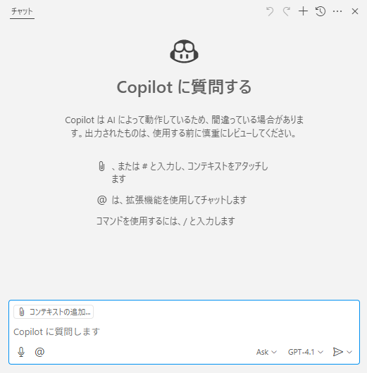
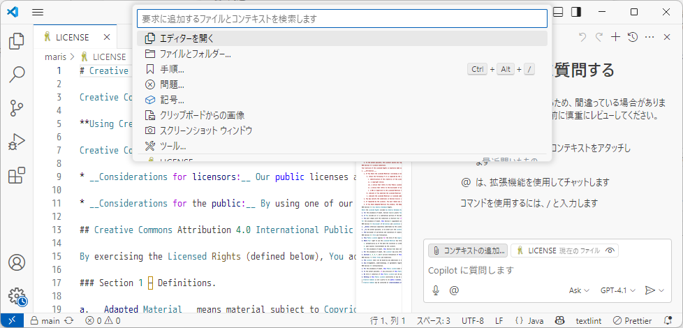
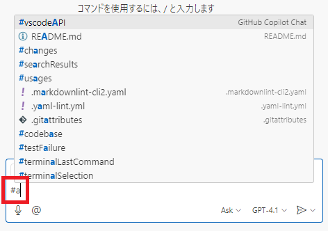

# ハンズオン：GitHub Copilot Chat の基本的な使い方

- [ハンズオン：GitHub Copilot Chat の基本的な使い方](#ハンズオンgithub-copilot-chat-の基本的な使い方)
  - [前提](#前提)
  - [1. 基本操作](#1-基本操作)
    - [チャットウィンドウを開く](#チャットウィンドウを開く)
      - [【ハンズオン】チャットウィンドウを開く](#ハンズオンチャットウィンドウを開く)
    - [プロンプトを送信する](#プロンプトを送信する)
      - [【ハンズオン】プロンプトを送信する](#ハンズオンプロンプトを送信する)
    - [プロンプトで markdown を使用する](#プロンプトで-markdown-を使用する)
      - [【ハンズオン】プロンプトで markdown を使用する](#ハンズオンプロンプトで-markdown-を使用する)
    - [プロンプトでスラッシュコマンドを使用する](#プロンプトでスラッシュコマンドを使用する)
      - [【ハンズオン】プロンプトでスラッシュコマンドを使用する](#ハンズオンプロンプトでスラッシュコマンドを使用する)
  - [2. プロンプトにコンテキストを明示的に含める](#2-プロンプトにコンテキストを明示的に含める)
    - [コンテキストとは](#コンテキストとは)
    - [プロンプトにチャット参加者を含める](#プロンプトにチャット参加者を含める)
      - [【ハンズオン】プロンプトにチャット参加者を含める](#ハンズオンプロンプトにチャット参加者を含める)
    - [プロンプトに様々なコンテキストを追加する](#プロンプトに様々なコンテキストを追加する)
      - [【ハンズオン】コンテキストにワークスペース内のファイルを追加する](#ハンズオンコンテキストにワークスペース内のファイルを追加する)

## 前提

- GitHub Copilot へのアクセス権が必要です。
- あらかじめ Visual Studio Code （以降、 VS Code と表記）および拡張機能 GitHub Copilot をインストールしてください。

## 1. 基本操作

### チャットウィンドウを開く

VS Code の上部のタイトルバーで  アイコンをクリックします。



#### 【ハンズオン】チャットウィンドウを開く

VS Code を開き、チャットウィンドウを開いてみましょう。

### プロンプトを送信する

チャットウィンドウ下部のプロンプトボックスにプロンプトを入力し、 `Enter` キーを押下するか送信ボタンをクリックします。
プロンプトボックス内で改行したい場合は、 `Shift` + `Enter` キーを押下します（または、テキストエディター等からコピー＆ペーストします）。

#### 【ハンズオン】プロンプトを送信する

チャットウィンドウに GitHub Copilot への質問を入力し `Enter` キーを押下してみましょう。

```plaintext
COBOL から Java への変換プロジェクトの範囲を決定する際に、コードベース、モジュール、および移行する必要がある機能の範囲をどのように決定しますか？　関与するステップは何ですか？
```

<details>
<summary>GitHub Copilot の回答例（※）</summary>

```plaintext
COBOL から Java への変換プロジェクトの範囲を決定する際は、以下のステップでコードベース、モジュール、機能の範囲を明確にします。

### 1. 現状分析

- 既存の COBOL システム全体の構成や依存関係を調査します。
- ソースコード、バッチ処理、外部インターフェース、データベース連携などを洗い出します。

### 2. 対象範囲の特定

- どのモジュールやプログラムが移行対象かを決定します（例：業務で使われているもの、今後も必要なもの）。
- 不要な機能や廃止予定のモジュールは除外します。

### 3. 機能要件の整理

- 各モジュール・プログラムが提供している機能を一覧化します。
- 現行の業務要件や利用状況をヒアリングし、移行すべき機能を確定します。

### 4. 依存関係・影響範囲の確認

- 他システムや外部サービスとの連携部分を特定します。
- データベースやファイル形式の違いも考慮します。

### 5. 優先順位付け

- 重要度や利用頻度、リスクなどをもとに、移行の優先順位を決めます。

### 6. 移行計画の策定

- スケジュールやリソース、テスト計画を含めた移行計画を作成します。

**まとめると、現状把握 → 対象範囲の特定 → 機能要件整理 → 依存関係確認 → 優先順位付け → 計画策定、という流れでプロジェクト範囲を決定します。**
```

</details>

---

※） **同じ質問でも回答が異なる場合があります。**
    生成AIは会話の流れや表現の微妙な違い、内部のランダム性などにより、同じ質問でも毎回まったく同じ回答を返すとは限りません。これは不具合ではなく、自然な言語の多様性を反映した仕様です。

### プロンプトで markdown を使用する

プロンプトでは markdown 形式を使用できます。

たとえば、コード例を挙げて複数の項目を質問したい場合、以下のようにプロンプトを記述できます。

```markdown
    以下の Java コードについて教えてください。

    ```Java
    public void DoSomething(String name) {
        // Do Something...
    }
    ```

    1. 〇〇は××ですか？
    1. △△は□□ですか？
```

コードブロックや箇条書きによって情報を整理することで、 AI に質問の意図や文脈が伝わりやすくなります。一般的な markdown の書き方については、 [Markdown Cheat Sheet | Markdown Guide](https://www.markdownguide.org/cheat-sheet/) を参照してください。

#### 【ハンズオン】プロンプトで markdown を使用する

チャットウィンドウに markdown 形式で質問文を入力して GitHub Copilot に質問してみましょう。

```plaintext
以下の COBOL コードについて質問があります。

    ```COBOL
       IDENTIFICATION DIVISION.
       PROGRAM-ID. Sample.
       DATA DIVISION.
       WORKING-STORAGE SECTION.
       01  NUM1        PIC 9(3) VALUE 100.
       01  NUM2        PIC 9(3) VALUE 200.
       01  RESULT      PIC 9(4).
       PROCEDURE DIVISION.
           ADD NUM1 TO NUM2 GIVING RESULT
           DISPLAY RESULT
           STOP RUN.
    ```

1. このプログラムの処理内容を説明してください。
1. NUM1 や NUM2 の値を変更した場合、どのような結果になりますか？
1. 計算結果をファイルに出力するにはどうすればよいですか？
```

<details>
<summary>GitHub Copilot の回答例</summary>

```plaintext
1. **このプログラムの処理内容を説明してください。**  
   NUM1（100）とNUM2（200）を加算し、その結果（300）をRESULTに格納して画面に表示するプログラムです。

2. **NUM1 や NUM2 の値を変更した場合、どのような結果になりますか？**  
   NUM1やNUM2の値を変更すると、加算結果（RESULT）もその値に応じて変わります。たとえば、NUM1を150、NUM2を250にすると、RESULTは400になります。

3. **計算結果をファイルに出力するにはどうすればよいですか？**  
   COBOLでファイル出力を行うには、ファイルの定義と書き込み処理を追加します。例：

   ```COBOL
   FILE SECTION.
   FD  RESULT-FILE.
   01  RESULT-REC    PIC 9(4).

   PROCEDURE DIVISION.
       OPEN OUTPUT RESULT-FILE
       ADD NUM1 TO NUM2 GIVING RESULT
       MOVE RESULT TO RESULT-REC
       WRITE RESULT-REC
       CLOSE RESULT-FILE
       STOP RUN.
    ```
```

</details>

### プロンプトでスラッシュコマンドを使用する

スラッシュコマンドとは、プロンプトの先頭に `/` （スラッシュ）を付けて入力することで、特定の機能や操作を AI に指示できるものです。

主なスラッシュコマンドの例：

- `/explain` … 選択したコードや、開いているコードファイルの説明を依頼する
- `/test` … テストコードの生成を依頼する
- `/fix` … バグ修正を依頼する
- `/help` … GitHub Copilot の使い方を確認する

その他のスラッシュコマンドの説明は [GitHub Copilot Chat チート シート - GitHub Docs](https://docs.github.com/ja/copilot/using-github-copilot/copilot-chat/github-copilot-chat-cheat-sheet?tool=vscode#slash-commands) を参照してください。

#### 【ハンズオン】プロンプトでスラッシュコマンドを使用する

スラッシュコマンドを使用して GitHub Copilot に質問してみましょう。

1. [Utilities.cpp](./examples/Utilities.cpp) を VS Code で開き、ファイル全体を `/explain` を使用して説明させる
1. 上のファイルの任意の範囲を選択し、 `/explain` で説明させる
1. `/help` で GitHub Copilot の使い方を確認する

<details>
<summary>上掲 1 のプロンプト例</summary>

```plaintext
@workspace /explain
```

※ `/explain` を入力して `Tab` キーを押下すると自動的に `@workspace` が入力されます。 `@workspace` の説明は後述します。

</details>

<details>
<summary>上掲 1 の GitHub Copilot の回答例</summary>

```plaintext
このコードは、C++で文字列のリストから重複を除去するためのユーティリティクラス `Utilities` を定義しています。

- `#include <vector>`, `#include <set>`, `#include <string>` は、それぞれ可変長配列（vector）、集合（set）、文字列（string）を使うための標準ライブラリです。
- `Utilities` クラスの中に、静的メソッド `Util1` が定義されています。
- `Util1` は `std::vector<std::string>` 型の入力（文字列リスト）を受け取り、`std::set` を使って重複を除去します。
- 最終的に、重複のない新しい `std::vector<std::string>` を返します。

このクラスを使うことで、簡単に「重複のない文字列リスト」を得ることができます。
```

</details>

## 2. プロンプトにコンテキストを明示的に含める

### コンテキストとは

「コンテキスト」とは、 AI が回答を生成する際に参照する情報や状況のことです。
たとえば、現在開いているファイルの内容、選択中のコード、プロジェクト全体の構成、直前の会話履歴などがコンテキストになりえます。

GitHub Copilot チャットでは、「チャット変数」や「コンテキストの追加」ボタンによりコンテキストを明示的に指定することもできます。
コンテキストを適切に指定することで、 AI はより関連性の高い、正確な回答を返しやすくなります。

### プロンプトにチャット参加者を含める

> チャット参加者は、支援を受けることができる専門知識を持つドメイン専門家のようなものです。

（ [IDE で GitHub Copilot に質問する - GitHub Docs](https://docs.github.com/ja/copilot/using-github-copilot/copilot-chat/asking-github-copilot-questions-in-your-ide#submitting-prompts) より）

主なチャット参加者の例：

- `@workspace` … 現在のプロジェクト（ワークスペース）全体の情報を AI に参照させるためのチャット参加者
- `@github` … GitHub 上のリポジトリ情報や、 Web 検索、エンタープライズのナレッジベースなど、外部の情報源を AI に参照させるためのチャット参加者
- `@vscode` … VS Code に関する操作や設定、使い方などを AI に参照させるためのチャット参加者

通常の質問では、開いているファイルや選択中のコードなど、限定的な情報だけが AI のコンテキストになりますが、チャット参加者を使用することで、プロジェクト内の他のコードやファイル、 GitHub 上のリポジトリ情報、外部 Web の情報などを含めて AI が回答を生成します。

その他のチャット参加者の説明は [GitHub Copilot Chat チート シート - GitHub Docs](https://docs.github.com/ja/copilot/using-github-copilot/copilot-chat/github-copilot-chat-cheat-sheet?tool=vscode#chat-participants) を参照してください。

#### 【ハンズオン】プロンプトにチャット参加者を含める

チャット参加者を使用して GitHub Copilot に質問してみましょう。

1. `@workspace` を使用して、 [Utilities.cpp](./examples/Utilities.cpp) について説明させる
1. `@github` を使用して、このリポジトリの概要を説明させる

<details>
<summary>上掲 1 のプロンプト例</summary>

```plaintext
@workspace /explain Utilities.cpp
```

</details>

<details>
<summary>上掲 1 の GitHub Copilot の回答例</summary>

```plaintext
    `Utilities.cpp` には `Utilities` クラスが定義されています。

    このクラスの中には、`Util1` という静的メソッドがあります。
    `Util1` は `std::vector<std::string>` 型の入力（文字列のリスト）を受け取り、
    `std::set` を使って重複を除去し、重複のない新しい `std::vector<std::string>` を返します。

    つまり、「文字列のリストから重複を除去した新しいリストを返す」ユーティリティ関数です。

    ```cpp
    // ...existing code...
    class Utilities {
    public:
        static std::vector<std::string> Util1(const std::vector<std::string>& input) {
            std::set<std::string> uniqueSet(input.begin(), input.end());
            return std::vector<std::string>(uniqueSet.begin(), uniqueSet.end());
        }
    };
    // ...existing code...
    ```

    **ポイント:**

    - `std::set` は自動的に重複を排除し、要素をソートします。
    - 元の順序は保持されません（辞書順になります）。
    - 静的メソッドなので、インスタンス化せずに `Utilities::Util1(...)` のように呼び出せます。

```

</details>

### プロンプトに様々なコンテキストを追加する

GitHub Copilot チャットウィンドウの「コンテキストの追加」ボタンで、さまざまなコンテキストをプロンプトに含めることができます。


「コンテキストの追加」ボタンをクリックすると、コマンドパレット部分に追加可能なコンテキストの種類が表示されます。



- **エディターを開く**  
    現在開いているエディター（ファイル）の内容をコンテキストとして追加します。
- **ファイルとフォルダー**  
    ワークスペース内の特定のファイルやフォルダーを選択し、その内容をコンテキストとして追加できます。複数選択も可能です。
- **関連ファイル**  
    現在のファイルと関連性の高いファイル（例：同じクラスのテストコードや実装ファイルなど）を自動的に提案し、コンテキストとして追加できます。
- **手順**  
    ワークスペース内のタスクやワークフロー、手順書などをコンテキストとして追加できます。 README やドキュメントの該当部分が対象になることが多いです。
- **問題**  
    現在のワークスペースで検出されているエラーや警告などの「問題」情報をコンテキストとして追加します。
- **記号**  
    クラス、関数、変数などの「シンボル」情報をコンテキストとして追加します。特定の関数やクラスの定義・宣言を AI に参照させたい場合に便利です。
- **スクリーンショットウィンドウ**  
    現在のエディターやウィンドウのスクリーンショット画像をコンテキストとして追加します。 UI や画面の状態を AI に伝えたい場合に使います。
- **ツール**  
    Linter やテストランナーなど、開発環境で利用しているツールの出力結果や設定情報をコンテキストとして追加します。 AI がツールの結果をもとにアドバイスできます。

また、プロンプトに `#` と入力すると、コンテキストの候補が表示されます。続けて文字を入力することで、候補を絞り込むことができます。



※ `#` だけ入力した状態ではすべての候補が表示され、選ぶのが困難です。 `#` は絞り込む前提で、含めたいコンテキストの名称が判明している場合に使用するのが良いでしょう。

#### 【ハンズオン】コンテキストにワークスペース内のファイルを追加する

1. 「コンテキストの追加」ボタンを押下、またはプロンプトに `#` を入力し、以下のファイルについて説明させる
    - `Utilities.cpp`
    - `RemoveDuplicates.cpp`
1. `@workspace` チャット参加者を使用し、上と同じファイルについて説明させる

<details>
<summary>上掲 1 のプロンプト例</summary>


</details>

<details>
<summary>上掲 1 の GitHub Copilot の回答例</summary>

```plaintext
### Utilities.cpp
- `Utilities` クラスを定義しています。
- クラス内の静的メソッド `Util1` は、`std::vector<std::string>` 型のリストから重複した文字列を除去し、重複のない新しいリストを返します。
- 実装では `std::set` を使って重複を排除しています。

### RemoveDuplicates.cpp
- `Utilities.cpp` をインクルードし、`Util1` 関数の使い方を示すサンプルプログラムです。
- 文字列のリスト（`input`）に重複した要素を含めて用意し、`Utilities::Util1` を使って重複を除去した結果を `result` に格納します。
- 結果を標準出力に表示します。

**まとめ:**  
`Utilities.cpp` は重複除去の機能を提供し、`RemoveDuplicates.cpp` はその機能の利用例（サンプル）です。
```

</details>
