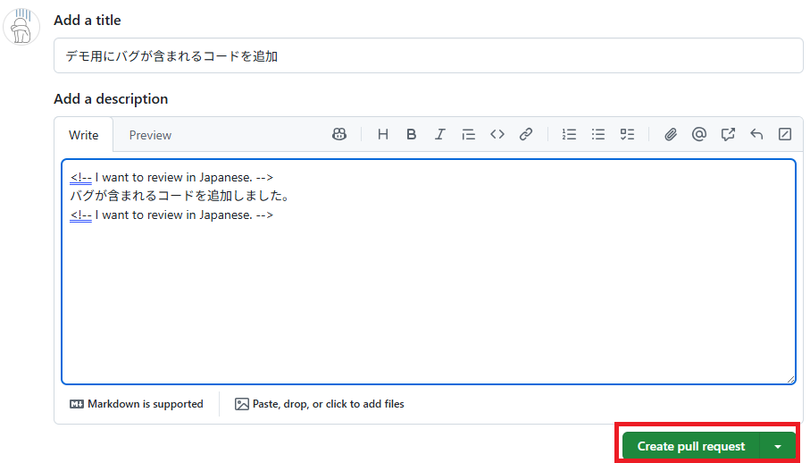

# 付録：リポジトリをフォークしてプルリクエストを作成する手順

## 前提

- [GitHub](https://github.com/) にアカウントを持っており、自分のリポジトリを作成できること

## リポジトリのフォーク

1. ブラウザーで [ai-education-hands-on](https://github.com/AlesInfiny/ai-education-hands-on) にアクセスし、リポジトリ名（ ai-education-hands-on ）右側の "Fork" 横の矢印を展開し、 "Create a new fork" を選択します。

    

1. "Create a new fork" 画面が表示されるので、以下を入力して "Create fork" をクリックします。
    - "Owner" を自分のアカウントに設定する
    - "Repository name" に適当な名前を入力する
    - **"Copy the main branch only" のチェックを外す（重要）**

    

## プルリクエストの作成

1. ブラウザーで再度フォークしたリポジトリにアクセスし、画面上部の "Pull requests" をクリックします。

    

1. 表示された画面で "New pull request" をクリックします。

    

1. **この手順は非常に重要です。必ず実施してください。**

    **"base repository" をクリックし、自分のリポジトリを選択しなおします。**

    

1. "compare" をクリックし、 "for-GitHub-Copilot-Code-Review" を選択します。

    

1. "Create pull request" をクリックします。

    

1. title と description を入力します。 GitHub Copilot に日本語でレビューしてほしい場合、 description の前後に `<!-- I want to review in Japanese. -->` と入力します。
    "Create pull request" をクリックします。

    

1. プルリクエストが作成されます。画面右側の "Reviewers" 右の歯車アイコンをクリックし、 Copilot を選択します。

    

1. しばらく待つと、 GitHub Copilot によるレビューコメントが書き込まれます。手順はこれで終了です。
