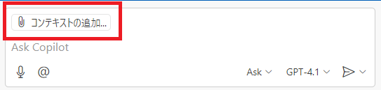

# ハンズオン：GitHub Copilot Chat の基本的な使い方

## 前提

- GitHub Copilot へのアクセス権が必要です。
- あらかじめ Visual Studio Code （以降、 VS Code と表記）および拡張機能 GitHub Copilot をインストールしてください。

## チャットウィンドウを開く

VS Code の上部のタイトルバーで  アイコンをクリックします。


### 【ハンズオン】チャットウィンドウを開く

VS Code を開き、チャットウィンドウを開いてみましょう。

## プロンプトを送信する

チャットウィンドウ下部のプロンプトボックスにプロンプトを入力し、 `Enter` キーを押下するか送信ボタンをクリックします。
プロンプトボックス内で改行したい場合は、 `Shift` + `Enter` キーを押下します。

### 【ハンズオン】プロンプトを送信する

チャットウィンドウに GitHub Copilot への質問を入力し `Enter` キーを押下してみましょう。

```plaintext
COBOL から Java への変換プロジェクトの範囲を決定する際に、コードベース、モジュール、および移行する必要がある機能の範囲をどのように決定しますか？　関与するステップは何ですか？
```

<details>
<summary>GitHub Copilot の回答例</summary>

COBOL から Java への変換プロジェクトの範囲を決定する際は、以下のステップでコードベース、モジュール、機能の範囲を明確にします。

### 1. 現状分析

- 既存の COBOL システム全体の構成や依存関係を調査します。
- ソースコード、バッチ処理、外部インターフェース、データベース連携などを洗い出します。

### 2. 対象範囲の特定

- どのモジュールやプログラムが移行対象かを決定します（例：業務で使われているもの、今後も必要なもの）。
- 不要な機能や廃止予定のモジュールは除外します。

### 3. 機能要件の整理

- 各モジュール・プログラムが提供している機能を一覧化します。
- 現行の業務要件や利用状況をヒアリングし、移行すべき機能を確定します。

### 4. 依存関係・影響範囲の確認

- 他システムや外部サービスとの連携部分を特定します。
- データベースやファイル形式の違いも考慮します。

### 5. 優先順位付け

- 重要度や利用頻度、リスクなどをもとに、移行の優先順位を決めます。

### 6. 移行計画の策定

- スケジュールやリソース、テスト計画を含めた移行計画を作成します。

**まとめると、現状把握 → 対象範囲の特定 → 機能要件整理 → 依存関係確認 → 優先順位付け → 計画策定、という流れでプロジェクト範囲を決定します。**

</details>

## プロンプトで markdown を使用する

プロンプトでは markdown 形式を使用できます。

たとえば、コード例を挙げて複数の項目を質問したい場合、以下のようにプロンプトを記述できます。

```markdown
    以下の Java コードについて教えてください。

    ```Java
    public void DoSomething(String name) {
        // Do Something...
    }
    ```

    1. 〇〇は××ですか？
    1. △△は□□ですか？
```

コードブロックや箇条書きによって情報を整理することで、 AI に質問の意図や文脈が伝わりやすくなります。

### 【ハンズオン】プロンプトで markdown を使用する

チャットウィンドウに markdown 形式で質問文を入力して GitHub Copilot に質問してみましょう。

```markdown
以下の COBOL コードについて質問があります。

    ```COBOL
       IDENTIFICATION DIVISION.
       PROGRAM-ID. Sample.
       DATA DIVISION.
       WORKING-STORAGE SECTION.
       01  NUM1        PIC 9(3) VALUE 100.
       01  NUM2        PIC 9(3) VALUE 200.
       01  RESULT      PIC 9(4).
       PROCEDURE DIVISION.
           ADD NUM1 TO NUM2 GIVING RESULT
           DISPLAY RESULT
           STOP RUN.
    ```

1. このプログラムの処理内容を説明してください。
1. NUM1 や NUM2 の値を変更した場合、どのような結果になりますか？
1. 計算結果をファイルに出力するにはどうすればよいですか？
```

<details>
<summary>GitHub Copilot の回答例</summary>

1. **このプログラムの処理内容を説明してください。**  
   NUM1（100）とNUM2（200）を加算し、その結果（300）をRESULTに格納して画面に表示するプログラムです。

2. **NUM1 や NUM2 の値を変更した場合、どのような結果になりますか？**  
   NUM1やNUM2の値を変更すると、加算結果（RESULT）もその値に応じて変わります。たとえば、NUM1を150、NUM2を250にすると、RESULTは400になります。

3. **計算結果をファイルに出力するにはどうすればよいですか？**  
   COBOLでファイル出力を行うには、ファイルの定義と書き込み処理を追加します。例：

   ```COBOL
   FILE SECTION.
   FD  RESULT-FILE.
   01  RESULT-REC    PIC 9(4).

   PROCEDURE DIVISION.
       OPEN OUTPUT RESULT-FILE
       ADD NUM1 TO NUM2 GIVING RESULT
       MOVE RESULT TO RESULT-REC
       WRITE RESULT-REC
       CLOSE RESULT-FILE
       STOP RUN.
    ```

</details>

## プロンプトでスラッシュコマンドを使用する

スラッシュコマンドとは、プロンプトの先頭に `/` （スラッシュ）を付けて入力することで、特定の機能や操作を AI に指示できるものです。

主なスラッシュコマンドの例：

- `/explain` … 選択したコードや、開いているコードファイルの説明を依頼する
- `/test` … テストコードの生成を依頼する
- `/fix` … バグ修正を依頼する
- `/help` … GitHub Copilot の使い方を確認する

その他のスラッシュコマンドの説明は [GitHub Copilot Chat チート シート - GitHub Docs](https://docs.github.com/ja/copilot/using-github-copilot/copilot-chat/github-copilot-chat-cheat-sheet?tool=vscode#slash-commands) を参照してください。

### 【ハンズオン】プロンプトでスラッシュコマンドを使用する

スラッシュコマンドを使用して GitHub Copilot に質問してみましょう。

1. [Utilities.cpp](./examples/Utilities.cpp) を VS Code で開き、ファイル全体を `/explain` を使用して説明させる
1. 上のファイルの任意の範囲を選択し、 `/explain` で説明させる
1. `/help` で GitHub Copilot の使い方を確認する

<details>
<summary>上掲 1 の GitHub Copilot の回答例</summary>

このファイルは `Utilities` というクラスを定義しており、`Util1` という静的メソッドを持っています。

- `Util1` メソッドは、`std::vector<std::string>` 型の入力を受け取り、重複を除いた文字列のリスト（ベクター）を返します。
- 内部では、まず `std::set<std::string>` を使って入力ベクターから重複を排除し、その後セットの内容を新しいベクターに変換して返しています。

つまり、`Util1` は「文字列のリストから重複を除去した新しいリストを返す」ユーティリティ関数です。

</details>

## プロンプトにチャット参加者を含める

> チャット参加者は、支援を受けることができる専門知識を持つドメイン専門家のようなものです。

（ [IDE で GitHub Copilot に質問する - GitHub Docs](https://docs.github.com/ja/copilot/using-github-copilot/copilot-chat/asking-github-copilot-questions-in-your-ide#submitting-prompts) より）

主なチャット参加者の例：

- `@workspace` … 現在のプロジェクト（ワークスペース）全体の情報を AI に参照させるためのチャット参加者
- `@github` … GitHub 上のリポジトリ情報や、 Web 検索、エンタープライズのナレッジベースなど、外部の情報源を AI に参照させるためのチャット参加者
- `@vscode` … VS Code に関する操作や設定、使い方などを AI に参照させるためのチャット参加者

通常の質問では、開いているファイルや選択中のコードなど、限定的な情報だけが AI のコンテキストになりますが、チャット参加者を使用することで、プロジェクト内の他のコードやファイル、 GitHub 上のリポジトリ情報、外部 Web の情報などを含めて AI が回答を生成します。

その他のチャット参加者の説明は [GitHub Copilot Chat チート シート - GitHub Docs](https://docs.github.com/ja/copilot/using-github-copilot/copilot-chat/github-copilot-chat-cheat-sheet?tool=vscode#chat-participants) を参照してください。

### 【ハンズオン】プロンプトにチャット参加者を含める

チャット参加者を使用して GitHub Copilot に質問してみましょう。

1. `@workspace` を使用して、 [Utilities.cpp](./examples/Utilities.cpp) について説明させる
1. `@github` を使用して、このリポジトリの概要を説明させる

<details>
<summary>上掲 1 の GitHub Copilot の回答例</summary>

Utilities.cpp には Utilities クラスが定義されています。

このクラスには静的メソッド Util1 があり、以下の処理を行います。

Util1 は std::vector<std::string> 型の入力（文字列のリスト）を受け取ります。
入力されたリストから std::set を使って重複を除去します。
重複を除いた新しい std::vector<std::string> を返します。
つまり、「文字列のリストから重複を除去した新しいリストを返す」ユーティリティ関数です。

</details>

## プロンプトにチャット変数を含める

チャット変数とは、プロンプトに埋め込むことで、特定の情報や状況を AI に伝えるためのキーワードです。

たとえば、`#file` や `#selection` などのチャット変数を使うと、  
「今開いているファイル」や「選択中のコード」など、その時点の具体的な情報を AI に渡すことができます。

主なチャット変数の例：

- `#file` … 現在開いているファイル全体
- `#selection` … 選択中のテキスト部分

チャット変数を使わなくても、 AI はコンテキストからどのファイルを使用するべきかある程度判断できます。しかし、チャット変数を使えば「この情報を使ってほしい」とはっきり指示できるため、より精度の高い回答が得られます。

その他のチャット変数の説明は [GitHub Copilot Chat チート シート - GitHub Docs](https://docs.github.com/ja/copilot/using-github-copilot/copilot-chat/github-copilot-chat-cheat-sheet?tool=vscode#chat-variables) を参照してください。

### 【ハンズオン】プロンプトにチャット変数を含める

チャット変数を使用して GitHub Copilot に質問してみましょう。

1. [Utilities.cpp](./examples/Utilities.cpp) を VS Code で開き、 `#file` と `/explain` を使用してファイルの内容を説明させる
1. [Utilities.cpp](./examples/Utilities.cpp) を VS Code で開き、任意の範囲を選択して `#selection` と `/explain` で選択範囲の内容を説明させる

<details>
<summary>上掲 1 の GitHub Copilot の回答例</summary>
このファイルは `Utilities` というクラスを定義しています。

- `Util1` という静的メソッドがあり、`std::vector<std::string>` 型の入力（文字列のリスト）を受け取ります。
- 入力されたリストから `std::set` を使って重複を除去します。
- 重複を除いた新しい `std::vector<std::string>` を返します。

つまり、「文字列のリストから重複を除去した新しいリストを返す」ユーティリティ関数を提供するクラスです。
</details>

## プロンプトにコンテキストを追加する

「コンテキスト」とは、 AI が回答を生成する際に参照する情報や状況のことです。
たとえば、現在開いているファイルの内容、選択中のコード、プロジェクト全体の構成、直前の会話履歴などがコンテキストになりえます。

コンテキストを適切に指定することで、 AI はより関連性の高い、正確な回答を返しやすくなります。

チャット参加者、チャット変数によって、コンテキストを追加することが可能です。他に、プロンプトの「コンテキストの追加」ボタンを使用することもできます。



### 【ハンズオン】プロンプトにコンテキストを追加する

