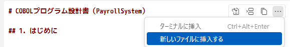

# レガシーコードから設計書をリバースする

1. GitHub Copilot Chat を開きます。
1. GitHub Copilot に次の質問をします。

    > `design-specification-templates\design-specification-template.md` に基づいて、 `legacy-codes/main.cobc` の設計書を作成してください。

1. GitHub Copilot によって作成された回答の右上の `...` をクリックし、「新しいファイルに挿入する」を選択します。

    

1. `designdoc-main.md` というファイル名を入力し、保存します。
